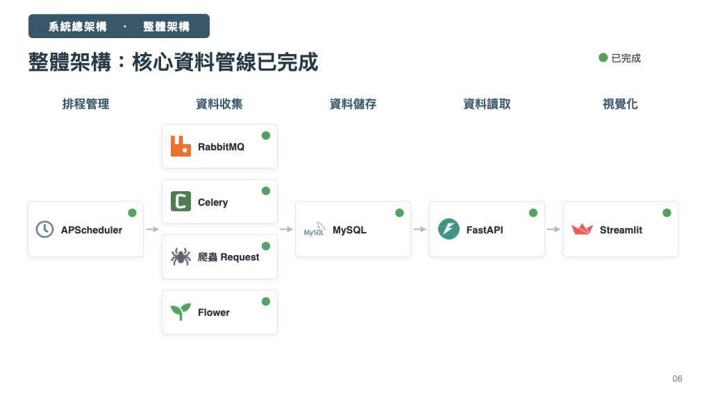
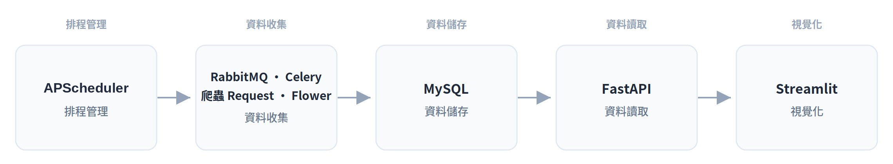

# 系統總架構

## 架構概覽

本專案是一條由排程驅動的資料管線（data pipeline），從爬蟲收集資料、寫入資料庫，最後透過 API 與儀表板呈現。整體分為五個階段：

> **目前狀態：核心資料管線已完成**，下列五個階段的元件皆已建置上線。

| 階段 | 元件 | 角色 |
| --- | --- | --- |
| 排程管理 | APScheduler | 定時觸發並排程整條資料管線的收集任務 |
| 資料收集 | RabbitMQ · Celery · 爬蟲 Request · Flower | 訊息佇列、分散式任務執行、網路爬蟲與任務監控 |
| 資料儲存 | MySQL | 儲存清洗後的結構化資料 |
| 資料讀取 | FastAPI | 對外提供查詢資料的 API |
| 視覺化 | Streamlit | 以儀表板呈現分析結果 |

## 資料流

APScheduler 觸發收集任務，透過 RabbitMQ 與 Celery 分派給爬蟲執行（Flower 負責監控），結果寫入 MySQL；FastAPI 從資料庫讀取資料對外提供，最終由 Streamlit 呈現視覺化結果。